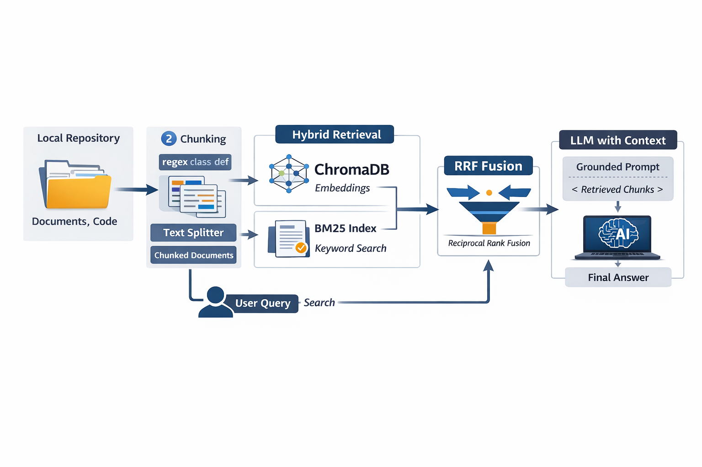

# CodeBaseAI

---
````markdown
# AI Codebase Assistant (For Local Repository)

It's an AI powered assistant that understands a local code repository and answers questions about code, functions, and logic using RAG.

The system actually indexes the repository, retrieves relevant code chunks, and uses an LLM for generating grounded responses. 

---

## Features
- Ask questions about a local codebase  
- Understand functions and classes  
- Hybrid retrieval (semantic + BM25)  
- Persistent vector database  
- Works locally  
- CLI interface 

---

# Quick Setup Instructions

## 1. Clone repo
```bash
git clone https://github.com/vinodmvd/CodeBaseAI.git
cd CodeBaseAI
```

## 2. Creating virtual environment
```bash
python -m venv venv
venv\Scripts\activate  
```

## 3.  Install Dependencies
```bash
pip install -r requirements.txt
```

## 4. OpenAI Key
Create `.env`
```bash
OPENAI_API_KEY=your_key
```

## 5. Run application
```bash
python main.py
```

---

# Architecture Overview


---

# Productionization Plan
## If deployed in cloud

### Changes needed:
- Replace ChromaDB with managed vector DB (Pinecone).
- OpenSearch from AWS for handly Sparse vector.
- Repeated quries can be cached and reused instead of going through the pipeline again. (Redis caching)
- FastAPI service to build as for API calls.
- Docker to build the image and run as a container.

---

## Scaling:
- Improvement to not perform ingestion when vector is already available in pickle, vector db. 
- Horizontal Scaling 

---

## Security:
- Repository Access control
- API authentications 

---

## Monitoring:
- Logging
- Tracing
- Metrics analysis

---

# RAG / LLM Approach and Design Decisions

## Chunking Strategy
Split code by
- class
- functions

**Why:** To preserve code's meaning

**Tradeoff:** Regex is simple, could have researched more to understand better modules for the ask.

---

## Embeddings
Model: `all-miniLM-L6-V2`

**Why:** Lightweight and faster.

**Tradeoff:** Would produce a lower accuracy than other coding based embedding models (EG: Jina Code Embedding V2).

---

## Retrieval
Hybrid retrieval:
- Dense Embeddings
- BM25 Keyword search

**Why:** Code queries often use exact names

**Tradeoff:** 
- Could have performed man marked documents to identify relevancy using recall, precision.
- Reranked could have improved the quality of the retriever.

---

## Prompt Design

- Force grounding.
- Provide citations for users to look back if required.
- No hallucinations.
- Answers only be produces from context.

---

## Context Window Management

- Finalized to have top_k of 5 retrieval to the model

**Tradeoff:** Token trimming should have been handled

---

## Guardrails
- If no relevant docs → return “not found”
- Prevent hallucinated answers

**Future improvements**
- Prompt injection detection
- Toxicity filtering

---

## Evaluation
Manual Testing:
- function lookup accuracy
- Explanation correctness
- Citation accuracy

Future:
- RAGAS evaluation

---

# Key Technical Decisions

1. Structural Code chunking (Using regex)
2. Lightweight Embedding model
3. Hybrid Retrieval
4. Persistent Local Vector store
5. BM25 persistence using pickle
6. LLM Choice (OpenAI - gpt-4o-mini (Small model with less cost))
7. CLI usage instead of UI
8. TOP-K retrieval of 5 when it reaches to LLM.

---

# Engineering Decisions

## Followed:
- Modular coding
- Config via env
- Separated Client service calls

## Skipped (consciously)
- UI integration
- Chat history storage
- Branch versioning.

**Reason:**  
Time-boxed implementation focused on core RAG quality.

---

# AI tool usage
## Tools:
- ChatGPT

## Used for:
- Validate output
- Debugging
- What algorithm does chromadb follow
- Regex usage help

## Validate: 
- Tested first while working with Jupitor notebook and modified accordingly to my requirement.

---

# Example Debug Prompts used

```
My app.py contains routes but retrieval returns other files first.
How can I improve ranking for relevant files?
```

# Future Improvements

- Reranking
- Observability (Phoenix)
- UI
- RAGAS evaluation
- Docker deployment
- Better token management